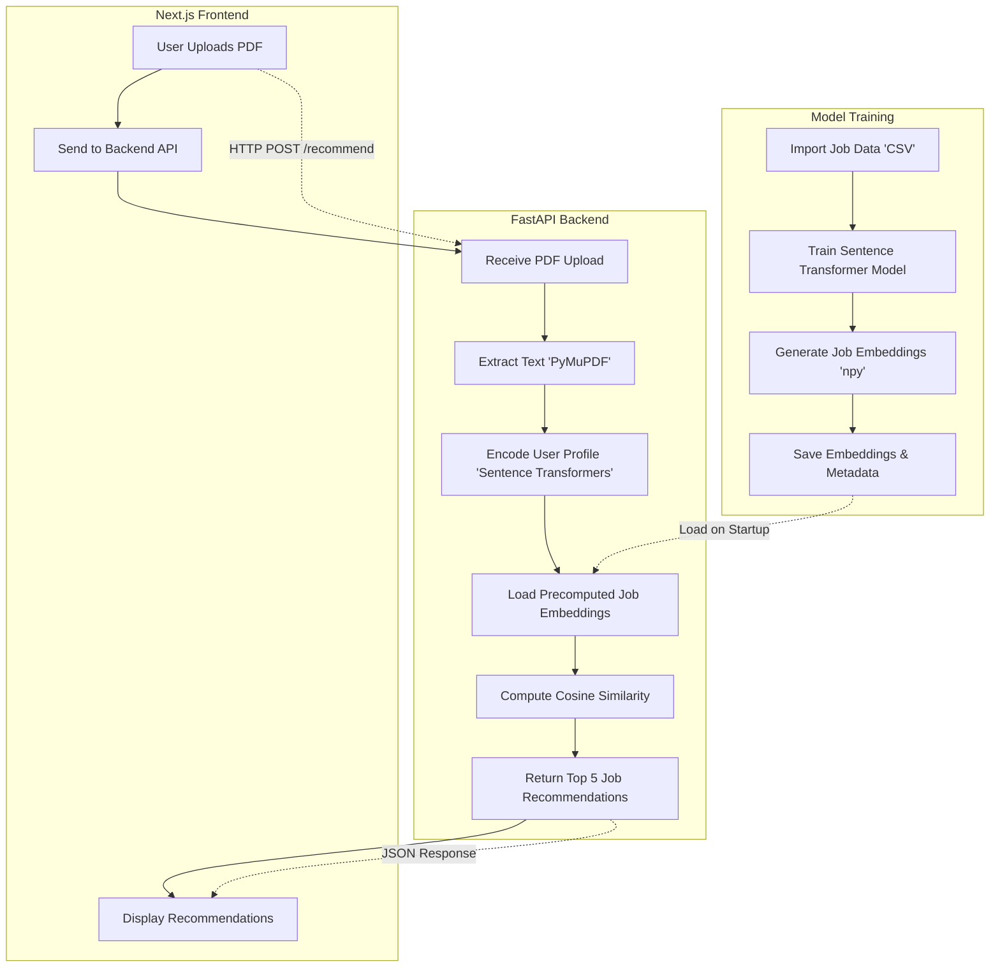

# PathFinder System Architecture

**Legend:**
- **Model Training:** Data preparation and embedding generation.
- **Backend:** Handles PDF upload, text extraction, encoding, similarity computation, and response.
- **Frontend:** User interface for upload and displaying recommendations.
- **Dashed arrows** represent communication between components.

---

This diagram provides a clear overview of how data and requests flow through the PathFinder system, from initial model training to user interaction and job recommendation delivery.
