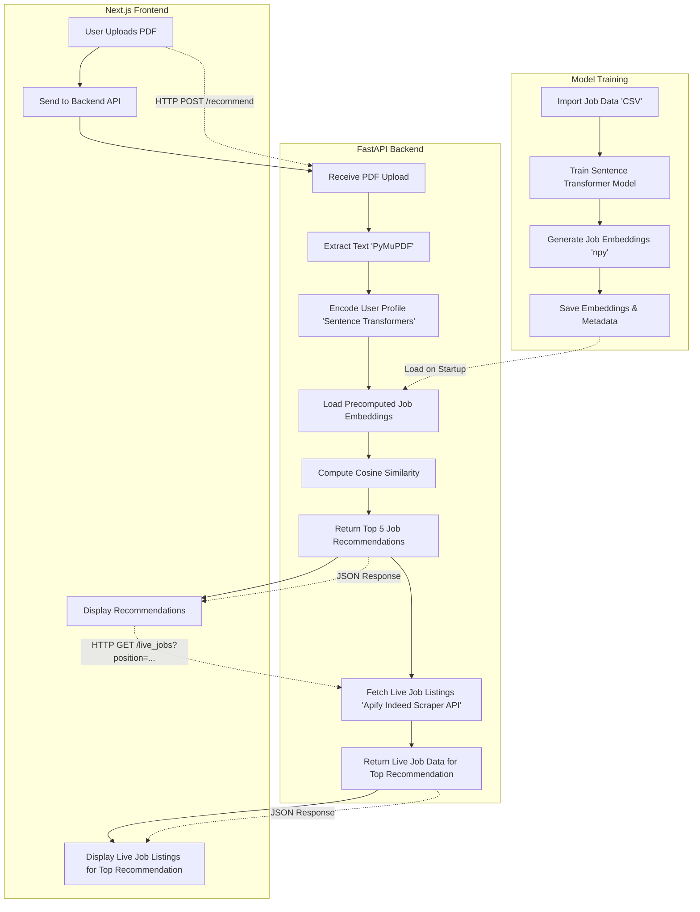

# PathFinder System Architecture

**Legend:**
- **Model Training:** Data preparation and embedding generation.
- **Backend:** Handles PDF upload, text extraction, encoding, similarity computation, job recommendation, and live job data fetching via Apify API.
- **Frontend:** User interface for upload, displaying recommendations, and asynchronously fetching/displaying live job listings for the top recommendation.
- **Dashed arrows** represent communication between components.

---

This diagram provides a clear overview of how data and requests flow through the PathFinder system, including integration with the Apify Indeed Scraper API for live job listings, from initial model training to user interaction and job recommendation delivery.
